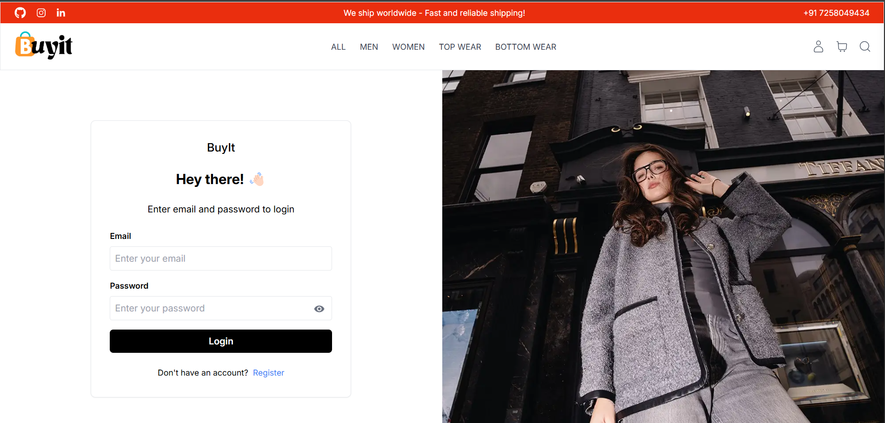
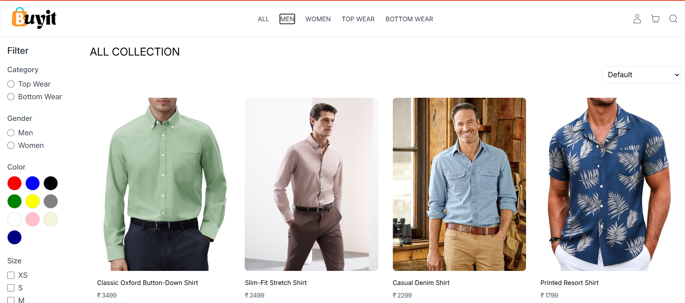
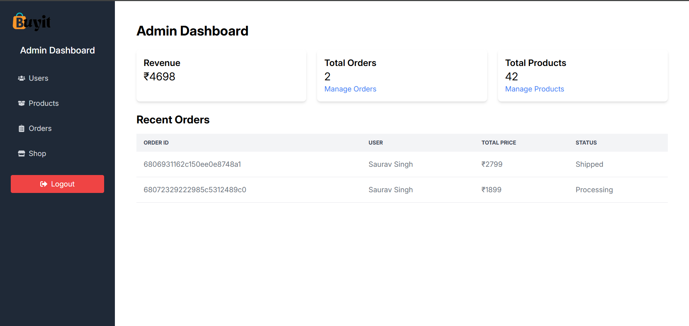
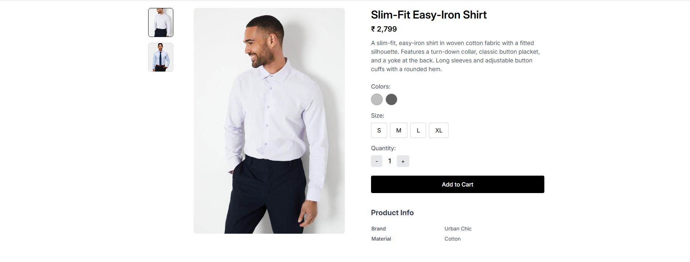
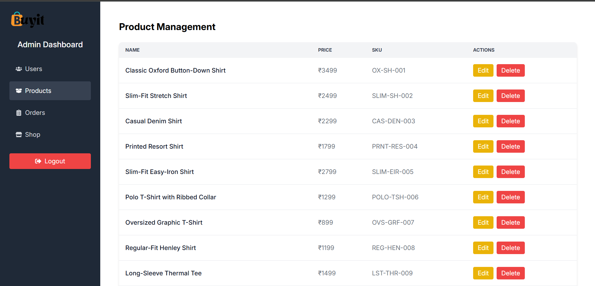

# 🛒 BuyIt - Full Stack E-Commerce Web App

**BuyIt** is a complete E-Commerce platform built using the **MERN** stack. It features secure authentication, product management, payment gateway integration, and cloud-based image handling. Whether you're shopping or managing the store, BuyIt provides a seamless experience for users and admins alike.
---

## 🌐 Live Demo

Check out the live version of **BuyIt** here:  
🔗 [https://buyit-self.vercel.app/](https://buyit-self.vercel.app/)

---

## 🚀 Features

- 🔐 User Authentication & Authorization (JWT)
- 🛍️ Product Listings with Filters and Categories
- 🖼️ Image Upload via Cloudinary
- 🛒 Add to Cart & Checkout
- 💳 Payment Integration (Stripe/PayPal)
- 👨‍💼 Admin Dashboard (User & Product Management)
- 🧾 Order Processing
- 🔒 Protected Routes (Admin/User)
- 📱 Responsive UI
- 🔍 Product Search

---

## 🧰 Tech Stack

### Frontend
- React.js
- React Router DOM
- Redux Toolkit 
- Axios
- TailwindCSS

### Backend
- Node.js
- Express.js
- MongoDB & Mongoose
- JWT (Authentication)
- Bcrypt.js
- Cloudinary
- PayPal

---

## 🖼️ Screenshots

Here’s a glimpse of **BuyIt** in action:

<p align="center">
  
  

  
  

  
  
</p>


---

## 🧑‍💻 Getting Started

Follow the steps below to run this project locally.


1️⃣ **Clone the repo:**  
```bash
git clone https://github.com/Saurav-KumarSingh/BuyIt.git
```

2️⃣ **Run Backend:**  
```bash
cd backend
npm install
npm run dev
```

3️⃣ **Run Frontend:**  
```bash
cd frontend
npm install
npm run dev
```
